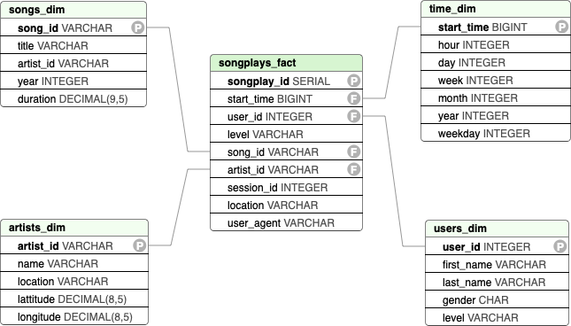

# Project: Data Modeling with PostGres
This project is concerned with the modeling of an *analytical database* for the data analytics team of the fictional music and audio streaming startup *Sparkify LLC*.
The analytics team is interested in different business related-questions, such as what songs the individual users are listening to, in order to make them recommendations for new songs and artists.

The project involves two tasks: The first is the design of a database which fulfils the analytical teams requirements. The second is the creation of a ETL-process which takes the raw data and transforms and inserts it into the newly created analytical database.

The raw data consists of two JSON-formatted document-based databases, one in which information about songs and artists is stored, and one which contains the logs of the customers' songplays.

Within this project, the target database will be loaded in a python script raw by raw using `for`-loops and SQL-`INSERT` statements. The main data engineering tool here, apart from `Python`, is [Pandas](https://pandas.pydata.org/). The implemented ETL-process is slow and cumbersome, but we will learn more efficient methods along the course of the data engineering nanodegree program. 

## The Raw Data
The raw data consists of two datasets which are JSON-formatted and document-based. For the sake of comprehensiveness, we paraphrase the description of these sets given in the project description:

The **song dataset** is a subset of the the [Million Song Dataset](http://millionsongdataset.com/). Each file contains metadata about a song and the artist of that song. The files are partitioned by the first three letters of each song's track ID. For example, here are file paths to two files in this dataset.
```
song_data/A/B/C/TRABCEI128F424C983.json
song_data/A/A/B/TRAABJL12903CDCF1A.json
```
The contents of a single song file of this set, for example `TRAABJL12903CDCF1A.json`, look as follows:
```
{
    "num_songs": 1,
    "artist_id": "ARJIE2Y1187B994AB7",
    "artist_latitude": null,
    "artist_longitude": null,
    "artist_location": "",
    "artist_name": "Line Renaud",
    "song_id": "SOUPIRU12A6D4FA1E1",
    "title": "Der Kleine Dompfaff",
    "duration": 152.92036,
    "year": 0
}
```

On the other hand, the **log dataset** consists of JSON-formated files which were generated using the [event simulator](https://github.com/Interana/eventsim) applied to the song dataset. These log files simulate activity logs (the "songplay history") from a music streaming app based on specified configurations, which were not further disclosed by Udacity but are also unimportant for our task.

The log files in the dataset we be working with are partitioned by year and month. For example, here are filepaths to two files in this dataset:
```
log_data/2018/11/2018-11-12-events.json
log_data/2018/11/2018-11-13-events.json
```
Below is an example of what the data in a log file, `2018-11-12-events.json`, looks like.


## Quick Start

In order to create the analytical database and tables, launch the python (>=3.6.3) script from a terminal:
```console
foo@bar:~$ python create_tables.py
```
The ETL-process can be started by launching:
```console
foo@bar:~$ python etl.py
```

The two Jupyter notebooks can be launched using either a JupyterLab or JupyterNotebook server, e.g.
```console
foo@bar:~$ jupyter-notebook etl.ipynb
```


## Purpose of the Analytical Database
The purpose of the analytical database and hence the corresponding ETL process is to enable the Sparkify's data analysis team to do fast and efficient queries about business related questions in a flexible manner.

The songplay history of a user can be easily extracted from the fact table `fact_table`, and ranked using their respective number of plays. We interpret a song as highly liked by the user if the song has been played a high number of times, in relative terms (cf. example queries below).

This result can be used for a recommender system: If the most liked songs of one user match the most liked songs of another user, measured by an appropriate metric, then also other songs liked by one user may be recommended to the other user. 

A standard example of such a [recommender system](https://en.wikipedia.org/wiki/Recommender_system) is the use of [cosine similarity](https://en.wikipedia.org/wiki/Cosine_similarity).

Furthermore, the database shall provide enough flexibility for Sparkify's analytical team to perform fast and spontaneous queries for other business-cases, such as finding songs to promote to a wide audience, do analytical queries on the demographics of the listeners etc.


## Database Scheme and Design
We are using a PostGres database server. The database itself is called `sparkifydb`. The tables within this database follow the star schema, enabling fast analytical querying.

There are five tables within this DB. 
The **fact table** in the center of the 'star' is named as follows: 
 - `songplays_fact`

The **dimensional tables** are:
 - `users_dim` - containing detailed user information,
 - `songs_dim` - information about the respective songs, and
 - `artists_dim` - information about the artists,
 - `time_dim` - more detailed infos about the time when the songplay occurred.


The schema relationships are as follows:




## ETL-Pipeline
The final ETL-pipeline which populates the analytical database is implemented in `etl.py` and consists of stages:

 1. Process raw song data,
 2. Process raw log data.

In the first stage, the song data is imported using `Pandas` and converted to a Python-`list`, selecting only a subset of five attributes which are necessary to fill `songs_dim`. The same is done with `artists_dim`, selecting also a subset of five attributes from the raw data and inserting into the table using a `for`-loop.

The second stage is more interesting. Firstly, the tables `time_dim` and `user_dim` are being populated. In order to populate `time_dim`, the timestamp `ts` from the log data is extracted and transformed using Pandas into the appropriate tuple 
```
('timestamp', 'hour', 'day', 'week of year', 'month', 'year', 'weekday')
```
Then, we insert `user_dim` in the direct way again, only selecting the specified columns from the log data, as we have done in the two dim-tables in the first stage. 

Finally, `fact_songs` is being populated by making an inner join of `artists_dim` with `songs_dim` on the common attribute `artist_id`.


## Repository
This repository contains the following files and directories:

```
├── data/
│   ├── log_data
│   └── song_data
├── images/
├── create_tables.py
├── etl.ipynb
├── etl.py
├── test.ipynb
├── sql_queries.py
└── README.md
```

- `data/`: Contains the raw data set and consists of the subfolders `song_data/` and `log_data/` which were descibed [above](#the-raw-data).

 - `create_tables.py`: Contains the functions to create the target databases. These are `create_database()`, `drop_tables()`, `create_tables()`, and finally a `main()`-function using these functions, i.e. creates a database, and subsequently drops and creates tables again.

- `sql_queries.py`: This file contains a collection of SQL query commands, encoded as python strings, which are organized into four blocks: `DROP_TABLES`, `CREATE_TABLES`, `INSERT_RECORD`, `FIND_SONGS`.
Finally, two lists of SQL commands, `create_list_queries`, and `drop_table_queries` are formed which are being used by the ``create_tables.py`.

 - `etl.ipynb`: The Jupyter notebook file which is used for discovery and experimentation.

 - `etl.py`: `process_song_file()` `process_log_file()` `process_data()`. Finally, the `main()`-function knits everything together.

 - `test.ipynb`: Contains a number of sanity checks which ought to be applied before submission of the project.

 - `README.md`: The file you are currently reading.


## [Optional] Example Queries
Extract the songplays by a user:
``` sql
    SELECT sp.song_id, s.title, COUNT(sp.songplay_id) AS num_of_plays
    FROM songplays AS sp
    INNER JOIN songs AS s ON sü.song_id = s.song_id
    GROUP BY sp.song_id, s.title
    ORDER BY COUNT(sp.songplay_id)
```

Calculate the average songplay duration:
```sql
    SELECT
```


Extract the songplays by a user and rank them by the number of songplays:
``` sql
    SELECT sp.user_id, u.last_name, u.first_name, t.year, t.month, t.day, t.hour,
    210 * COUNT(sp.songplay_id) AS time_spent,
    FROM songplays AS sp
    INNER JOIN users AS U ON sp.user_id = u.user_id
    INNER JOIN time AS t ON sp.start_time = t.start_time
    GROUP BY sp.user_id, u.last_name, u.first_name, t.year, t.month, t.day, t.hour
    ORDER BY sp.user_id, u.last_name, u.first_name, t.year, t.month, t.day, t.hour
```


